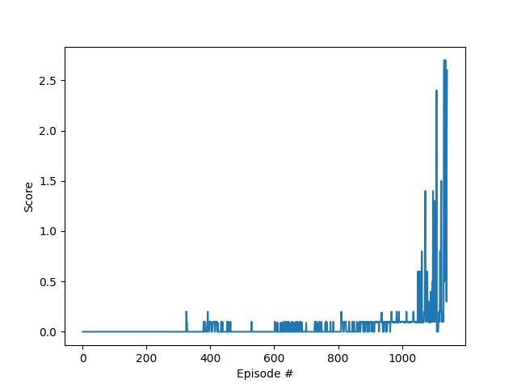

# Project Report

## Learning Algorithm

The learning algorithm used in this project is Multi Agent Deep Deterministic Policy Gradients (MADDPG) outlined in this [research paper](https://papers.nips.cc/paper/2017/file/68a9750337a418a86fe06c1991a1d64c-Paper.pdf). It is an adaptation of the Deep Deterministic Policy Gradients (DDPG) algorithm for multi-agent domains.

This algorithm fits into a category of RL algorithms called Actor Critics. These algorithms are so called because they train 2 neural networks, the actor which is policy-based and the critic which is value-based. As a result Actor Critic agents get the best of both worlds - they are more stable than value-based agents and need fewer samples than policy-based agents.

The main difference between DDPG and MADDPG is the latter shares an Actor and Critic network between multiple agents. These agents act independently using their own local observations, but train a centralised network.

## Implementation

#### Model architecture for the neural network:
Actor
- input batch normalised
- input: 24 (state size), output: 256 (ReLu activation)
- input: 256, output: 256 (ReLu activation)
- input: 256, output: 2 (action size, tanh activation)
        
Critic
- input batch normalised
- input: 24 (state size), output: 256 (ReLu activation)
- input: 256+2, output: 256 (ReLu activation)
- input: 256, output: 1 (No activation) 

#### Steps taken to generate the final network:

- Implemented DDPG algorithm as used in [previous project](https://github.com/ryanw3bb/ml-agents-continuous-control)
- Moved Actor and Critic network instantiation to MADDPG class
- MADDPG instantiates DDPG agents with num_agents based on state input
- Increased network units to 256 as seemed to give better results
- Tweaked hyperparameters to improve training speed

#### Hyperparameters used in the final training solution:

buffer_size = int(1e5)  
batch_size = 128        
gamma = 0.995           
tau = 1e-3             
lr_actor = 1e-3        
lr_critic = 1e-3     
weight_decay = 0        
learn_every = 10        
learn_sample = 10       
sigma = 0.1             
theta = 0.15              

## Results

Episode 100	Average Score: 0.00  
Episode 200	Average Score: 0.00  
Episode 300	Average Score: 0.00  
Episode 400	Average Score: 0.02  
Episode 500	Average Score: 0.02  
Episode 600	Average Score: 0.00  
Episode 700	Average Score: 0.03  
Episode 800	Average Score: 0.01  
Episode 900	Average Score: 0.04  
Episode 1000	Average Score: 0.09  
Episode 1100	Average Score: 0.21  
Episode 1141	Score: 2.60	Running Average: 0.51  
Environment solved in 1141 episodes!	Average Score: 0.51  

## Future Work

- Tweak hyperparameters to improve output
- Investigate other algorithms such as PPO, A3C or D4PG
- Implement prioritised experience buffer
